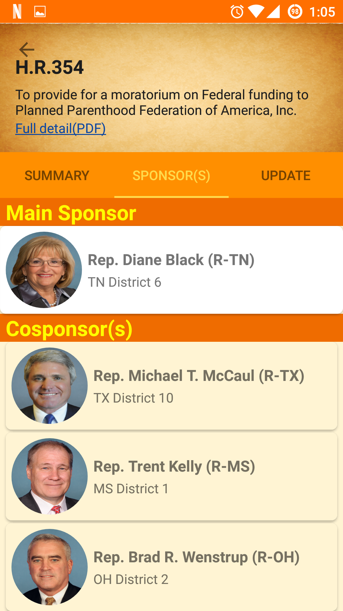

#  Political Local

## Overview
This is an app that heavily focus on the current political scene in DC so that the average American citizens can get the most up to date information. This app is heavily focused on Material Design to provide the cleanest user experience.

## Features
- Use location to find your representatives and Senators
  - The ability to also view their contributors
  - Call to action by calling, email or sending them a tweet.
  

    
    
    
  

- Customized news to get the most recent news about their Legislatures
  - News links are being handled in app using custom chrome tab.
  

    
    
  

- Grab recents bills
  - Ability to view details of the bills such as: Summary, Tags, Sponsors and Updates.
  

    
    
  

- Search all function
  

    
  

- Implements <a href="https://material.io/">Material Design</a> for the best UI/UX experience.

## Major issues and future implementation
- Improve the UI and UX of the app
- Juggling between two different API to get the most up to date info in congress and versatile search function.
- Shifting thru the mountain of data
- Allow users to save their favorite bills and candidates on the cloud.
- Smarter search function - ability to know the entity of the search term
- News section will be hard to scale in the future as it is depends on Bing News Search API.
- Senators and Representatives votes on bills.
- Tablet and landscape friendly

## Acknowledgement

#### Sunlight foundation
A huge thanks to <a href="https://sunlightfoundation.com/">Sunlight foundation</a> for providing free API service to search for Legislatures by location and names. Also the ability to get bill summary and the ability to search bill by tags and titles.

#### Propublica
Thanks <a href="https://propublica.org">Propublica</a> for providing the most up to date data on the legislative bills in congress.

#### OpenSecrets
Legislatures contribution data made possible by <a href="https://www.opensecrets.org/politicians/"> OpenSecrets</a>.

#### Launcher icon

Icon made by <a href="http://www.freepik.com" title="Freepik">Freepik</a> from <a href="http://www.flaticon.com" title="Flaticon">www.flaticon.com</a> is licensed by <a href="http://creativecommons.org/licenses/by/3.0/" title="Creative Commons BY 3.0" target="_blank">CC 3.0 BY</a>

---

## Licensing
1. All content is licensed under a CC­BY­NC­SA 4.0 license.
2. All software code is licensed under GNU GPLv3. For commercial use or alternative licensing, please contact [legal@ga.co](mailto:legal@ga.co).
